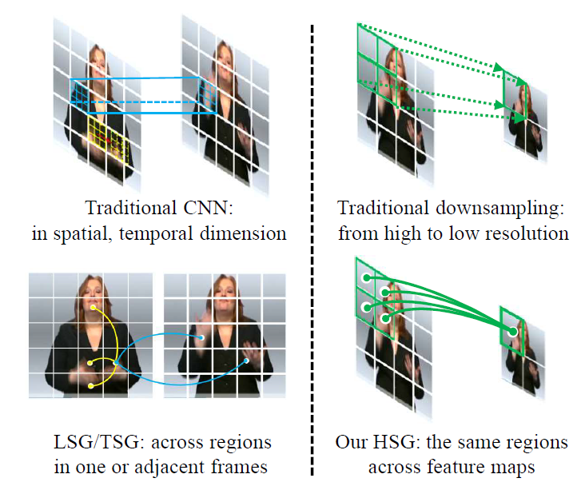

# SignGraph & MixSignGraph &A simpler Baseline for SLR / SLT


<!-- Hero images (drawn from /doc/) -->
<p align="center">
  
</p>

<p align="center"><em>A simpler baseline implementation and visual overview for SignGraph / MixSignGraph.</em></p>

<p align="center">
  <a href="https://openaccess.thecvf.com/content/CVPR2024/papers/Gan_SignGraph_A_Sign_Sequence_is_Worth_Graphs_of_Nodes_CVPR_2024_paper.pdf"></a>
  <a href="https://openreview.net/forum?id=YjZYMHvlRs"></a>
</p>

This repository contains the code and baseline models for SignGraph and MixSignGraph — two graph-based approaches for Sign Language Recognition (SLR) and Sign Language Translation (SLT). The codebase provides data loaders, model implementations, training & evaluation scripts and configuration files for standard benchmarks (PHOENIX2014, PHOENIX2014-T and CSL).

Key repositories / folders

- `SignGraph/` — original SignGraph baseline implementation, training and evaluation scripts.
- `MixSignGraph/` — MixSignGraph implementation and improved baseline scripts.
- `SignSLRT-Baseline/` — A simpler Baseline for SLR / SLT.

Why this repo?

- Implements recent CVPR/NeurIPS research for sign language modeling.
- Ready-to-run configs for common datasets.
- Modular code: datasets, modules, GCN helpers, training and evaluation are separated for clarity.

## Table of Contents

- [Highlights](#highlights)
- [Requirements](#requirements)
- [Quick Start](#quick-start)
- [Data Preparation](#data-preparation)
- [Usage Examples](#usage-examples)
- [Configuration & Logs](#configuration--logs)
- [Citation](#citation)
- [Contributing](#contributing)
- [Contact & Acknowledgements](#contact--acknowledgements)

## Highlights

- SignGraph (CVPR 2024): Represent sign sequences as graphs of nodes to capture spatial-temporal relations.
- MixSignGraph (NeurIPS 2025): Mixed-graph extension with improvements for translation and robustness.

## Requirements

- Python 3.8+ (project contains compiled files from 3.8 — use Python 3.8 or newer)
- PyTorch (version used in experiments is documented in `SignGraph/requirements.txt`)

Install dependencies (example):

```powershell
python -m pip install -r SignGraph/requirements.txt
```

If you prefer the MixSignGraph environment, check `MixSignGraph/README.md` or install the same dependencies there.

## Quick Start

1. Clone this repository (if you haven't):

```powershell
git clone https://github.com/gswycf/SignLanguage.git
cd SignLanguage
```

2. Prepare data (see next section).

3. Run training (example):

```powershell
# SignGraph example: adjust --config to the config you want
python SignGraph/main.py --config SignGraph/configs/phoenix2014.yaml

# MixSignGraph example
python MixSignGraph/main2.py --config MixSignGraph/configs/phoenix2014.yaml
```

4. Run evaluation / inference (example):

```powershell
python SignGraph/main.py --config SignGraph/configs/phoenix2014.yaml --eval True --checkpoint /path/to/checkpoint.pth
```

Notes:

- The project uses YAML config files under each `configs/` folder. Edit them to change dataset paths, training hyperparameters, and model-specific flags.
- Many helper scripts and utilities are under `utils/` and `modules/`.

## Data Preparation

Supported datasets and where to obtain them:

1. PHOENIX2014 dataset
   - Download: https://www-i6.informatik.rwth-aachen.de/~koller/RWTH-PHOENIX/

2. PHOENIX2014-T dataset
   - Download: https://www-i6.informatik.rwth-aachen.de/~koller/RWTH-PHOENIX-2014-T/

3. CSL dataset
   - Request / download: https://ustc-slr.github.io/openresources/cslr-dataset-2015/index.html

After downloading, extract the datasets. The baseline expects the standard layout used by PHOENIX/CSL benchmarks — no extra preprocessing is required beyond placing the data in the paths referenced by the YAML config files.

If you need to change dataset paths, edit the appropriate `configs/*.yaml` and update the dataset root(s).

## Usage Examples

Common scripts:

- `SignGraph/main.py` — training and evaluation entrypoint for the SignGraph baseline.
- `MixSignGraph/main2.py` — entrypoint for the MixSignGraph implementation.
- `SignGraph/seq_scripts.py`, `MixSignGraph/seq_scripts.py` — dataset / sequence utilities.

Example training command (adjust flags):

```powershell
python MixSignGraph/main2.py --config MixSignGraph/configs/phoenix2014.yaml --epochs 50 --batch_size 16
```

Example inference (evaluation) command:

```powershell
python SignGraph/main.py --config SignGraph/configs/phoenix2014.yaml --eval True --checkpoint ./checkpoints/best.pth
```

Tip: Use the provided YAML configs under `MixSignGraph/configs/` or `SignGraph/configs/` as starting points. They include common dataset splits and model settings used in experiments.

## Configuration & Logs

- Training logs, checkpoints, and tensorboard outputs are created in the working directory by default. Check your config files to customize `save_dir`, logging frequency, and evaluation intervals.

## Citation

If you use this repository in your work, please cite the associated papers:

```latex
@inproceedings{gan2025mixsigngraph,
  title={MixSignGraph: A Sign Sequence is Worth Mixed Graphs of Nodes},
  author={Gan, Shiwei and Yin, Yafeng and Jiang, Zhiwei and Xie, Lei and Lu, Sanglu and Wen, Hongkai},
  booktitle={The Thirty-ninth Annual Conference on Neural Information Processing Systems},
  year={2025}
}

@inproceedings{gan2024signgraph,
  title={SignGraph: A Sign Sequence is Worth Graphs of Nodes},
  author={Gan, Shiwei and Yin, Yafeng and Jiang, Zhiwei and Wen, Hongkai and Xie, Lei and Lu, Sanglu},
  booktitle={Proceedings of the IEEE/CVF Conference on Computer Vision and Pattern Recognition},
  pages={13470--13479},
  year={2024}
}

@inproceedings{gan2023towards,
  title={Towards Real-Time Sign Language Recognition and Translation on Edge Devices},
  author={Gan, Shiwei and Yin, Yafeng and Jiang, Zhiwei and Xie, Lei and Lu, Sanglu},
  booktitle={Proceedings of the 31st ACM International Conference on Multimedia},
  pages={4502--4512},
  year={2023}
}

@inproceedings{gan2023contrastive,
  title={Contrastive learning for sign language recognition and translation},
  author={Gan, Shiwei and Yin, Yafeng and Jiang, Zhiwei and Xia, Kang and Xie, Lei and Lu, Sanglu},
  booktitle={Proceedings of the Thirty-Second International Joint Conference on Artificial Intelligence, IJCAI-23},
  pages={763--772},
  year={2023}
}

@article{han2022vision,
  title={Vision gnn: An image is worth graph of nodes},
  author={Han, Kai and Wang, Yunhe and Guo, Jianyuan and Tang, Yehui and Wu, Enhua},
  journal={Advances in neural information processing systems},
  volume={35},
  pages={8291--8303},
  year={2022}
}
```

## Contributing

Contributions are welcome. For small improvements (typos, docs), open a PR. For larger changes (new models, refactors), please open an issue first so we can iterate on design.

Suggested contribution workflow:

1. Fork the repo and create a feature branch.
2. Add tests or a short example demonstrating your change.
3. Open a PR describing the change and link training/evaluation logs if relevant.

## Contact & Acknowledgements

- Maintainer: gswycf (GitHub)
- Authors: Gan et al. (see cited papers)

Thanks to the original authors and the open-source community for the research and code this baseline builds upon.

---

If you'd like I can also:

- Add a small Quick Start notebook or short tutorial documenting a single end-to-end run (data -> train -> eval).
- Add CI badges, automated tests, or a recommended environment (conda/venv) file.

Feel free to tell me which of the above you'd like next.
